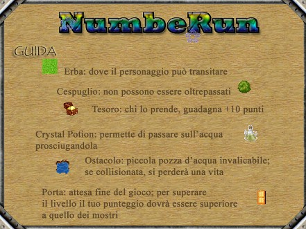

NumbeRun
========

NumbeRun is a puzzle game I developed in 2007 for my school-leaving examination. The game was developed in [Microsoft Visual C#](http://www.visualstudio.com/) 2005 using the [Microsoft XNA](https://it.wikipedia.org/wiki/Microsoft_XNA) library.

https://user-images.githubusercontent.com/1681269/199839122-efc19341-57f6-4408-8eca-524b4940458a.mp4

Play Now
--------

[Download NumbeRun](https://github.com/marcomontalbano/numberun/releases/latest) and play now on Windows 10.

Before play, you need to install DirectX and XNA from `setup` folder.

_system requirements:_

- [Microsoft .NET Framework 2.0](http://www.microsoft.com/it-it/download/details.aspx?id=1639)
- Microsoft XNA 1.0
- Windows XP / 7 / 8 / 8.1 / 10

Screenshots
-----------

   

Plot
----

FiveRun has been trapped in the kingdom of DarkRun, an evil wizard who will do anything to prevent his escape.

You are the only one who can help FiveRun in his mission: leave DarkRun's lands stealing as much gold as he can. Mind though: these grounds are full of dangers! Pay attention to the GrumRuns (in the next release they will be renamed GrimRuns, 'cause I made a mistake), wicked creatures serving Lord DarkRun: they will haunt you and won't find their peace until they catch you.

In order to move from land to land, you need to find a magic door that you will be able to cross unscathed only if - that's for you to find out! :wink:

Now you are ready to follow FiveRun in this adventure.

One last friendly piece of advice: FiveRun can't swim!

Other versions
--------------

NumbeRun has been written in different programming languages during the years. The first version was in Pascal, then the game was re-written in C, then C++, then C++ with OpenGL and in the end in C# with Microsoft XNA.

The first release of the complete game was in C++ using a Windows Console, a big bidimensional matrix and **numbers as characters**, that's why the name is **NumbeRun** (numbers that run).

It was my very first project, the very first idea I worked on, just after starting high school. Every time I discovered a new language I took the chance to re-write it, so as to master the new knowledge. That's why there are so many versions of the same game. It evolved along with my competence.

   

Open Source
-----------

On GitHub you can find all versions. Feel free to download, build and play :)

Check out the repository for source codes and binary files.
